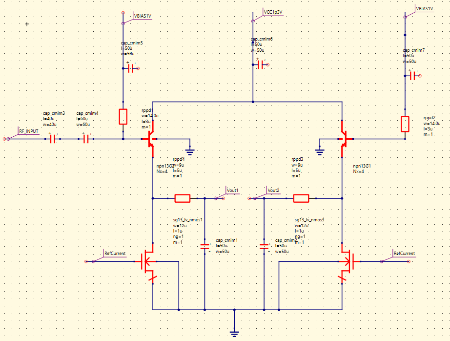
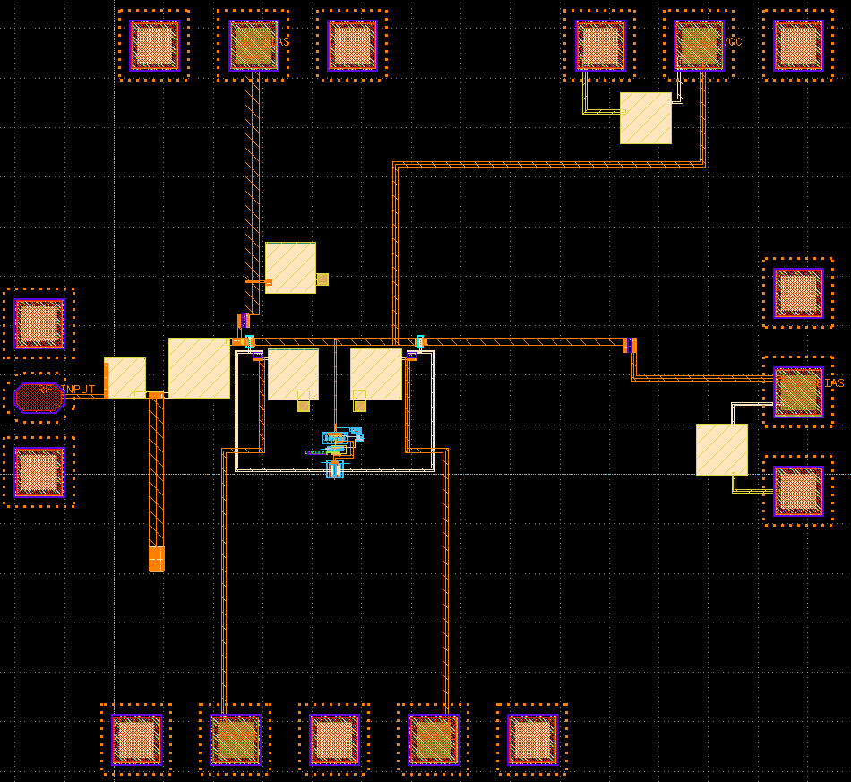
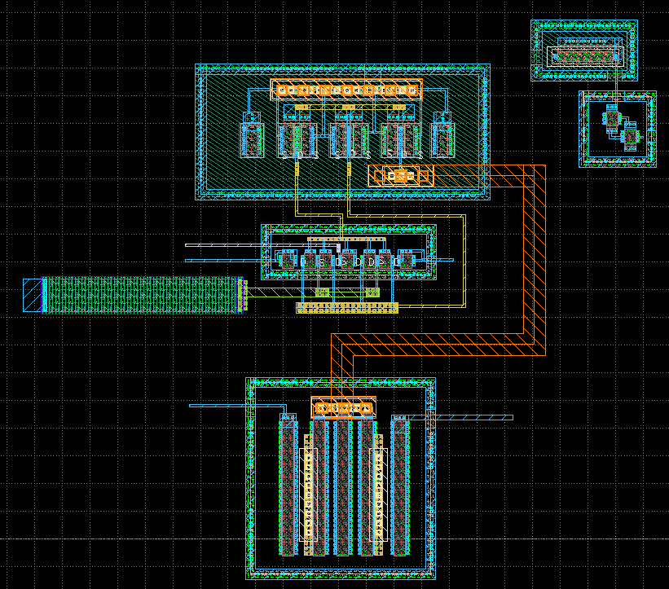
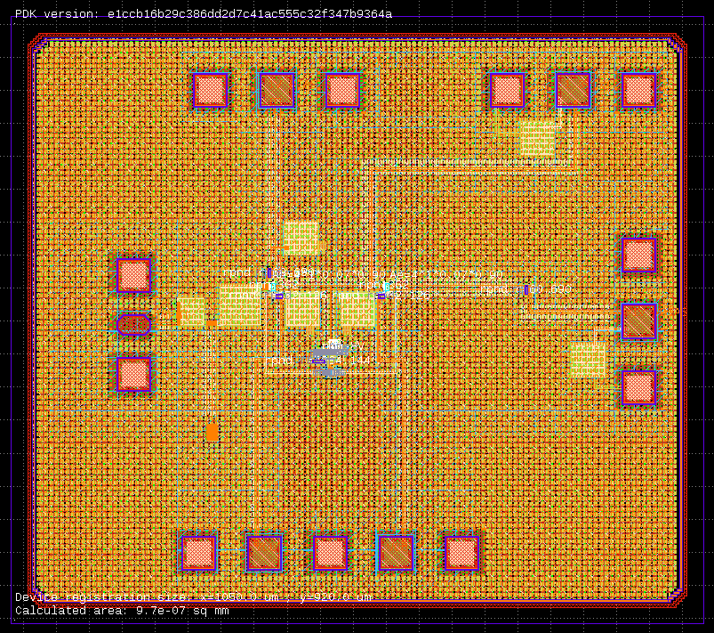
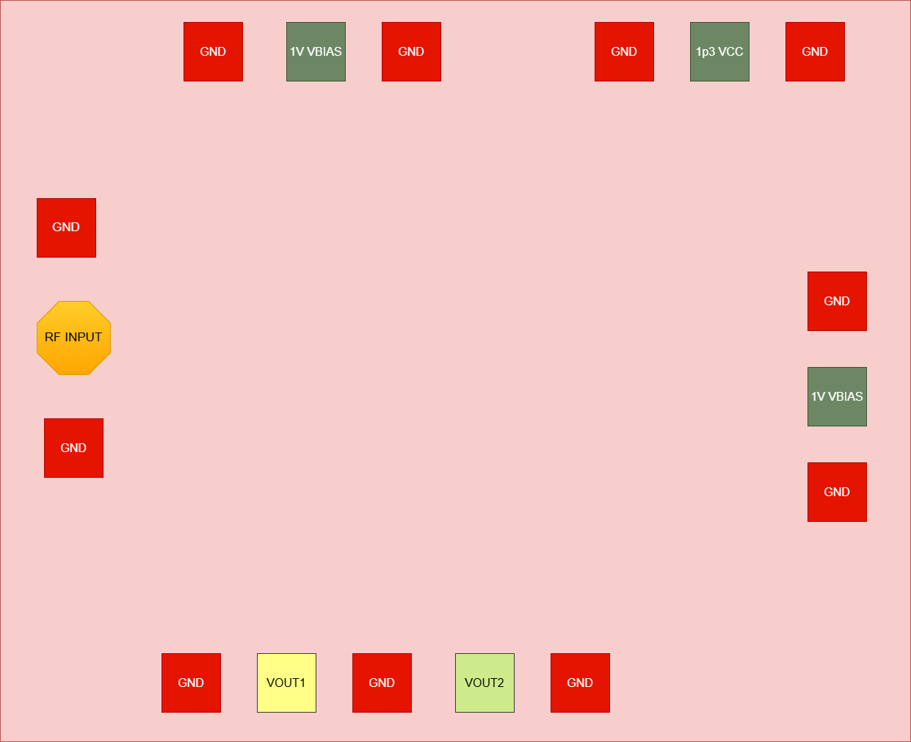
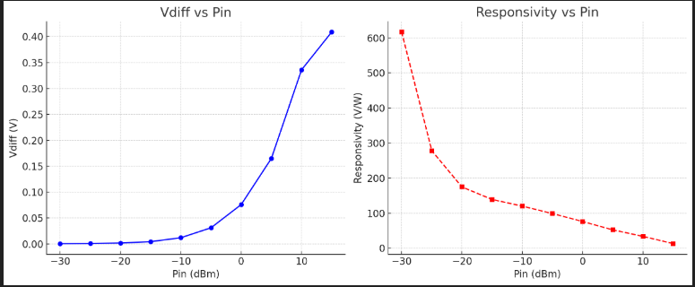
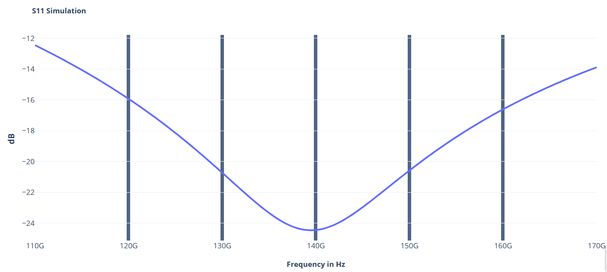

**Design data and design process description**
####################################################

The Design is primarily a meyer rf power detector. It uses a single ended rf input
and produces a differential rectified dc output proportional to rf signal.

**Circuit design**
################################

Meyer RF Power Detector consists of 2 part - 

I) Power Detector

II) Beta Multiplier

Power Detector
--------------------------
the meyer rf power detector uses a 1V bias and 1.3V VCC. the left portion of the 
detector rectifies the rf input and produces proportional dc voltage. The right
part of design is a dc offset provider ensures there is 0V dc for 0 rf input. 20uA current
is flowing in each branch provided by nmos current sources.

Beta Multiplier
---------------------

The beta multiplier produces the 20uA reference current. There is a starter circuit and also
the copy branch which provides the 20uA reference current to the main power detector.

.. image:: _static/Beta_Multiplier_Schematic.PNG
    :align: center
    :alt: IHP Logo Image.
    :width: 800

**Layout Design**
##########################################

Power Detector Layout
----------------------------------------------

Beta Multiplier Layout
---------------------------------------------

Full GDS with Fillers
----------------------------------------------

**Pin-Out**
-----------------------------------

**Layout information**
----------------------------------------
.. list-table::
   :widths: 40 40
   :header-rows: 1

   * - **Area**
     - 1050 um X 920 um
   * - **GSG Pad Size**
     - 30 X 50 Signal, 50 X 50 Ground 
   * - **GSG Pad Pitch** 
     - 75 um
   * - **DC Pad Size & Pitch**
     - 50 X 50 , 100 um pitch   

**Simulation Result**
##############################################
Output Voltage and Responsivity at 110 GHz -
--------------------------------------------------

.. image:: _static/110_GHz.PNG
    :align: center
    :alt: IHP Logo Image.
    :width: 800

Output Voltage and Responsivity at 140 GHz -
--------------------------------------------------

.. image:: _static/140_GHz.PNG
    :align: center
    :alt: IHP Logo Image.
    :width: 800

Output Voltage and Responsivity at 170 GHz -
--------------------------------------------------

S11 Simulation
----------------------------------------------------

**Achieved Result**
######################################
.. list-table:: **Results**
   :widths: 40 40
   :header-rows: 1

   * - Dynamic Range
     - 45 dB
   * - **Responsivity**
     - > 600 V/W 
   * - **S11** 
     -  < - 10 dB
   * - **DC Ripple**
     - < 8 %    
